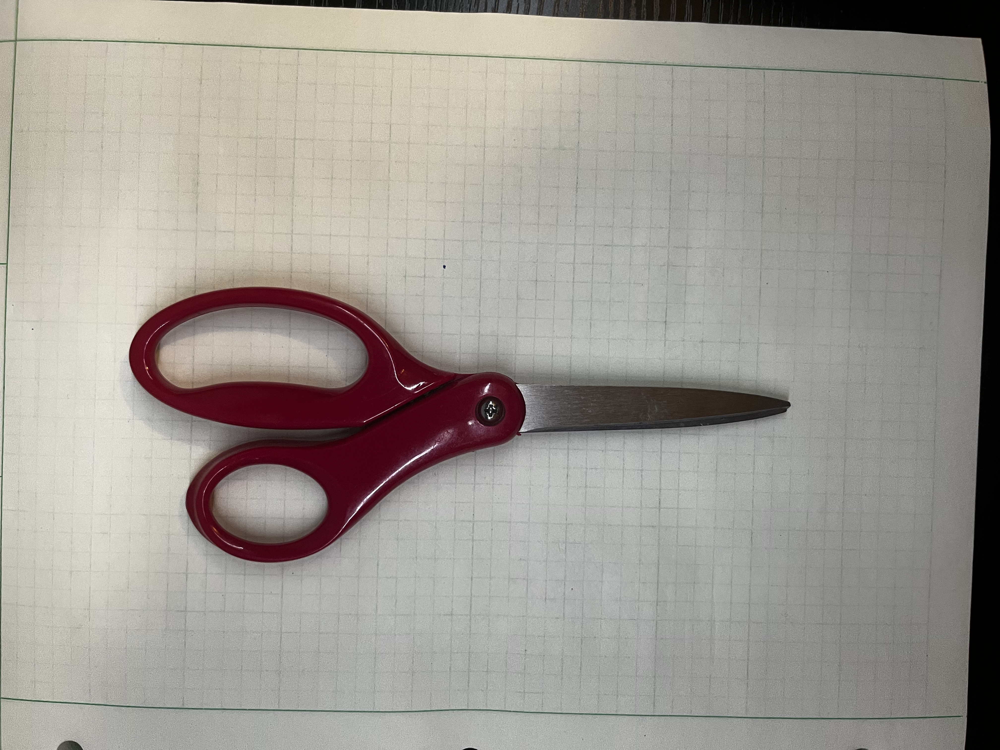
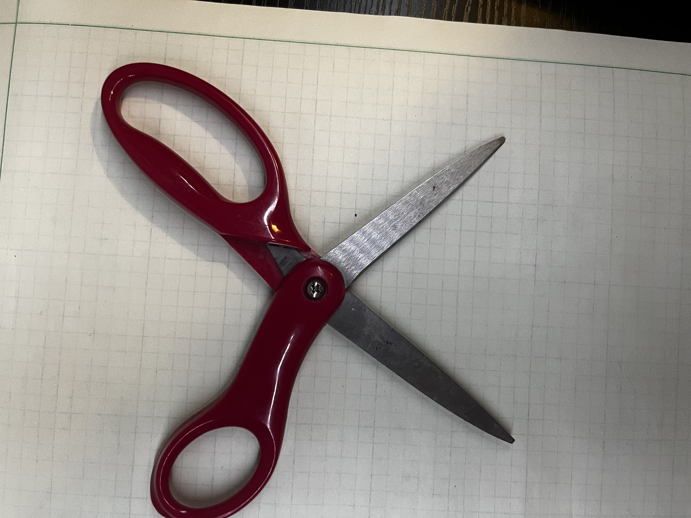
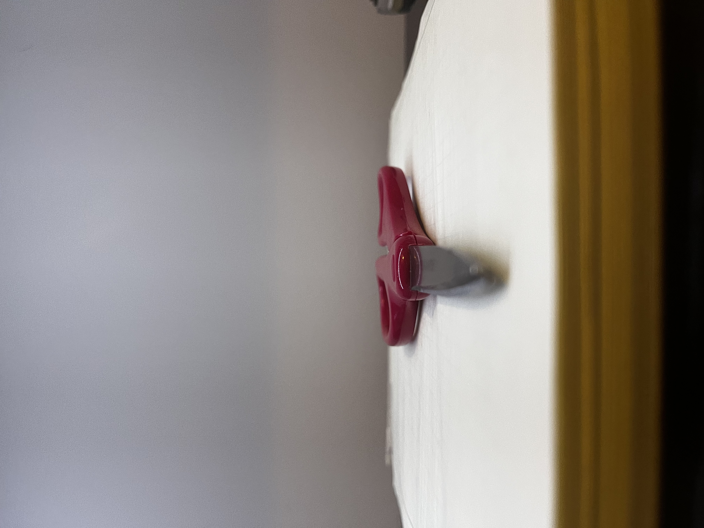
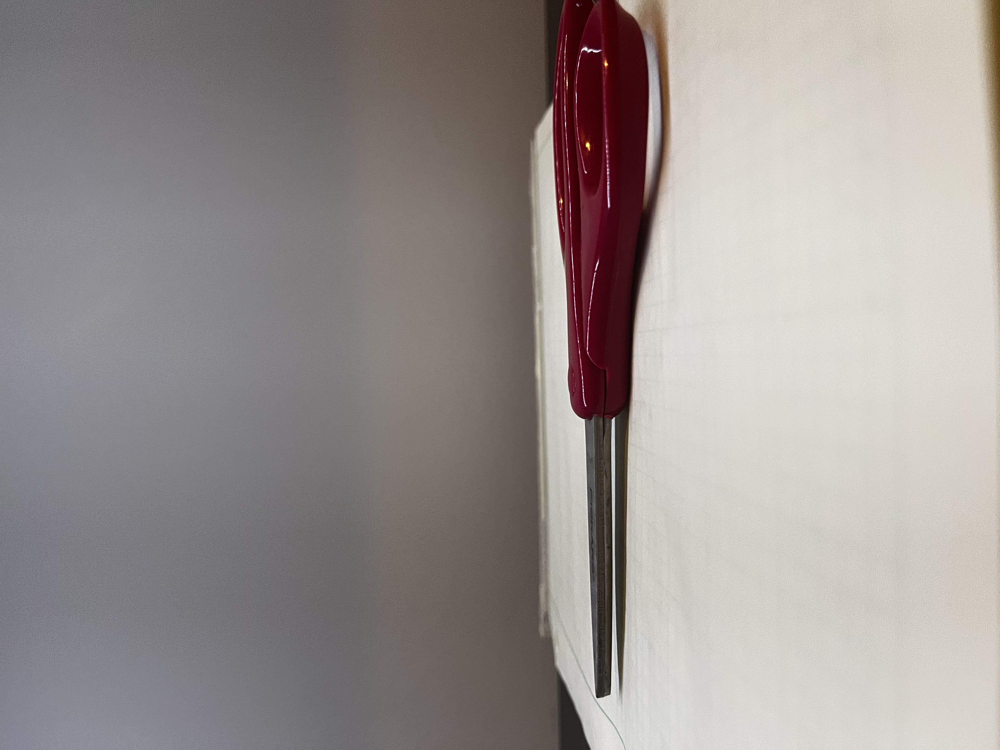
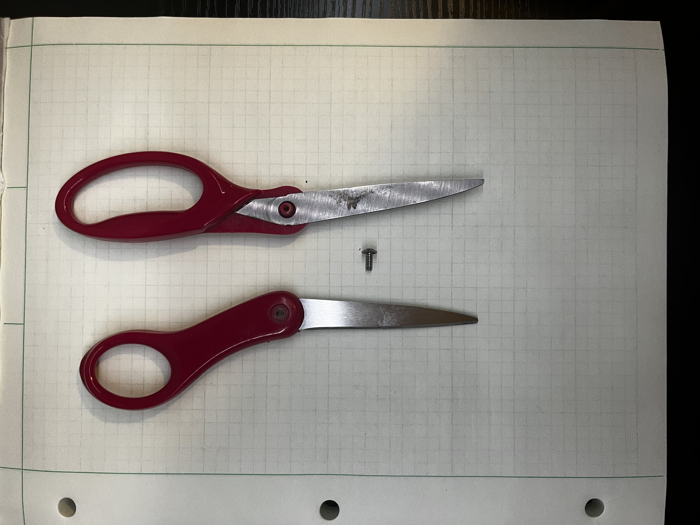

# A1 – Building a Professional Portfolio 

## Objectives
1.) Build an understanding of how a clear and organized portfolio can be used to communicate an engineering process effectively by analyzing and critiquing other engineering profiles.  

2.) Analyze a specific product and its components, communicate what function the product uses to complete its task, and identify specific reasons as well as alternative solutions to component parts.  

3.) Implement a design change on personal portfolio and explain reasoning behind this change.  

4.) Create a clear and concise "About Me" section on the website page and answer questions.  

## Analyze
### Task A: Portfolio Analysis  

This task requires critical thinking and understanding of what a portfolio is. In a brief summary, a portfolio for a mechanical engineer is a website, PDF, or other representation that documents and outlines projects the mechanical engineer has completed. It holds information and a clear path the engineer took to solve a problem. All work on the project is documented and conveyed in a clear and precise manner, to where anyone can replicate the project effectively. In this task, two portfolios will be analyzed based on the criteria of Navigability, Reproducibility, Evidence and Reasoning, and Professionality.  

**Case 1: Luke DeVries**  

Luke DeVries is a student at University of North Carolina at Charlotte that has previously taken the Sophomore Design Class. This is the link to the website that will be analyzed: https://instructure.charlotte.edu/eportfolios/4880/welcome.  

Luke's website is easily navigated, having headers and a running list of sections down the side that showcase his work. The layout begins with a section about why the portfolio is created and its intended use. This allows for anyone accessing the website to find information needed about the author of the website and the contents of the portfolio itself based on his personal description. There is a small inconsistency that the headers of each section are labeled as "Assignment X" instead of what the project actually contains. However, this can be overlooked as the main function of the site is to display the projects specifically from the Sophomore Design Class. If and when Luke adds a personal project or other information, this should be updated with a specific header or the assignments moved to an Assignment section added later.  

All the projects and documents in Luke's website are extremely detailed and very concise. Upon inspection of the assignments listed through the site, a person can very easily reproduce and recreate every assignment listed. Luke describes all the objectives, processes, and conclusions very well with plenty of photographed evidence and documentations of results. He also admits certain failures and problems that occurred during the assignments, which allows for a person recreating the results to avoid certain mistakes he made. Overall, Luke shows an understanding of evidence-based reasoning. All choices on the projects were explained in a manner that led to a final conclusion.

The tone conveyed in this portfolio is mostly professional to employers and engineers. Luke is able to convey ideas in a manner that will allow for repeatable results and also displays the work done in a project. However, to make it even more professional, Luke should have avoided using first person to document results. Most professional documents use passive voice in research and development to refrain from personal opinion and focus mainly on the topic covered and the data needed for the designs and projects. From an employer's perspective, it does make sense to insert himself into the documentation for exemplifying his skills, but not to engineers. Engineers need facts and data to interpret and find results. If a new and unique way to solve a problem is discovered, self insertion into this method is unnecessary, as it is already implied that the person documenting the results is the one that made the discoveries. It is important to note that while the tone is not perfect, it still relays information reliably and accurately.

**Case 2: TJ Watson**

TJ Watson is is a mechanical engineer that graduated from the Worcester Polytechnic Institute with a double major in Robotics Engineering and Mechanical Engineering. He currently is employed at Aurora Innovation as a Staff Hardware Engineer. This is the link to his portfolio that is being analyzed: https://www.tjwatson.net/work.html  

TJ's website is laid out in a simplistic way that allows the user to navigate through the tabs located at the top of the website. The user is able to find out personal information on TJ, his work experience and education, as well as information on his projects through his career. His resume is linked into the website as well for access to his employment and previous experiences. All the information on TJ's projects. Understandably, all of the projects he has worked on have limited access due to the nature of his work, but general information and patents of projects are documented as well as some pictures. A person would not be able to reproduce the work easily based on what is given, but they can find out more information based on the products on the websites. Under the assumption that not all the work is given to the public domain, the evidence of the projects TJ has worked on are only the final results, and not the whole process, so the user cannot draw conclusions based on the information given.

From a professional standpoint, the tone of the website is very laid-back. No engineering terminology is used and the website is mainly centered on what TJ has accomplished, rather than the process of those accomplishments. For a company looking to hire TJ, this is acceptable, but between other engineers, it is not. There is further documentation that might have these processes that the user does not have access to that would explain the projects further, but it is not directly stated on the portfolio.

### Task B: Product Analysis  

Task B requires an in-depth analysis of a physical product that is constrained to have three or less physical components and is mechanical in nature. 

#### Analyzed Component: Office Scissors

Scissors are a tool that is used to cut objects using mechanical leverage and shear force. These can range from paper and plastic materials to human tissue in a surgical setting. The object analyzed will be office scissors, which are mainly used to cut paper and cardboard material.

**Mechanics of Scissors**  

As stated earlier, the function of scissors relies on mechanical leverage and shear force as the main components to cleave objects.

**Mechanical Leverage**
For scissors that use Mechanical Leverage, the calculated leverage is equal to ***Lin/Lout***. In the case of scissors, the variable of ***Lin*** is the distance between the force applied from the users fingers to the pivot, or fulcrum point on the scissors. The variable ***Lout*** is the distance from the fulcrum to the point of the blade. This calculation gives you a factor of how much the force is multiplied by. 

**Shear Force**
Scissors use shear force to cleave objects apart. This force can be calculated as ***Tau = F/A***. Tau is the shear force, ***F*** is the force applied to the blades of the scissors, and ***A*** is the cross-sectional area where the blades meet the cutting object. Since the blade's cross-sectional area is very small, this allows the shear force to become very large.

**FISKARS H-1000 Office Scissors**  

This product utilizes the mechanics of shear force and mechanical leverage, making it a valid, functioning pair of office scissors.  

 

**Figure 1: Top View of Scissors**
  

  

**Figure 2: Open Top View**
  

  

**Figure 3: Front Profile** 
  

  

**Figure 4: Side Profile**
  

  

**Figure 5: Components of Scissors**
  

The geometry of the product is exemplified in the figures. The first two figures give an overview of the function of the scissors. Pivoting around the fulcrum, the blade is able to shear the objects that need to be cut. It can be seen how the blade opens and closes to complete this task. The side profiles show the grip for the scissors which allow for control and easier handling. The final picture displays the components of each shear and the screw it pivots on. This gives a full understanding of how the product is machined and assembled, and how each part interacts to complete the task of cutting an object.

The office scissors analyzed are the FISKARS H-1000 Office Scissors. The components that make this product are a screw used as the fulcrum, and two four inch shear blades with a four inch handle. The patent number for the specific scissors shown above is [USD383957S](https://patents.google.com/patent/USD383957S/en?oq=USD383957). The author on this patent is Robert W. Cornell. 

Due to the simplicity of the nature of office scissors (Increasing length of blade increases leverage, decreasing cutting area), it is better to list alternative devices from scissors that serve the same function and use similar mechanics. One device is an office paper trimmer. This assists in cutting larger stacks of paper and thicker office materials using a lever arm with a blade. The blade is much longer than a scissor blade and the fulcrum point is attached to the base of the trimmer. This allows for a much larger mechanical advantage and increases the shear force of the trimmer to be able to handle more paper to cut than the H-1000 scissors. Another device that uses similar mechanics to scissors is Loop scissors. These use the exact same mechanics as the H-1000 scissors, except there is a spring that allows the blades to separate back to a cutting position for more efficient use. This however creates a more complex system, which involves spring mechanics to return the blades to the open position and also adds the extra component of the spring.  

In the original patent for the office scissors, they use a pin at the fulcrum. This pin allows the scissors to rotate freely which can lead to opening the scissors at unintended times and can even injure the user if not careful. The H-1000 scissors use a threaded screw in the plastic handle to allow fore a more precise opening, but also allows the scissors to remain closed when not in use. This leads to less accidents and more control over the cut to the paper.

## Decide

## Communicate

### Task 1 and 2: Populate the Portfolio

These two tasks require the user to add their name, objective of the portfolio, and an "About Me" section to their portfolio for future reference. See the above section for content

### Task 3: Defend Your Position

This task requires for the portfolio author to answer a question that will be referred to and reflected upon throughout the semester.

***Question: "What does it mean to defend an engineering decision : and do you currently know how to do it?"***  

While I do not know exactly what this means or how to do it yet, I will take an educated guess to answer this question. Defending an engineering decision could mean a multiple of things. Based on the constraints; time,  money,  and resources available, no one can create the perfect product or find the absolute best possible solution, but we can get close. Defending your position as an engineer means that you sacrificed one of these constraints for the best results in your opinion as an engineer. This could be you increased the cost of a product to design it to be safer or you spent more time developing a part to take up less resources. Whatever the decision, as an engineer, you will have to give your professional opinion on why you made certain choices on a design. Defending your choice may come to showing results of data or cost analysis depending on what you chose to defend. 

### Task 4: Time Log

Time spent on Assignment 1: 8 hours and 13 minutes over the course of 4 days
